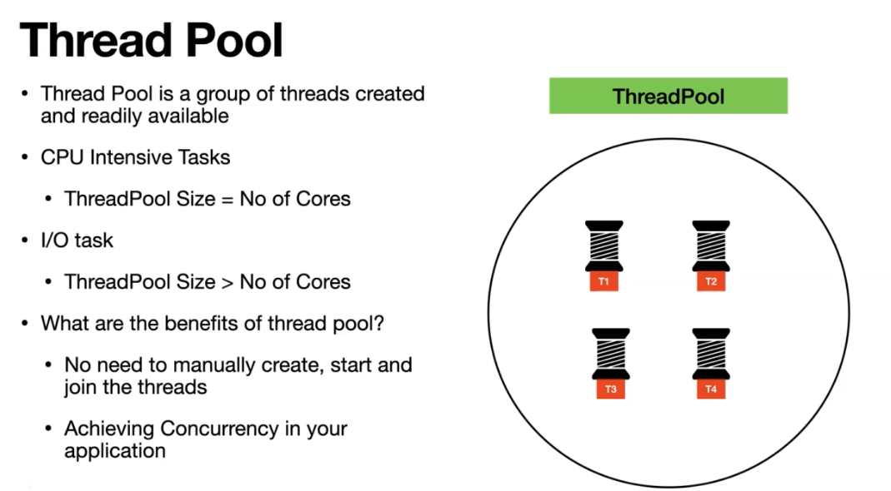
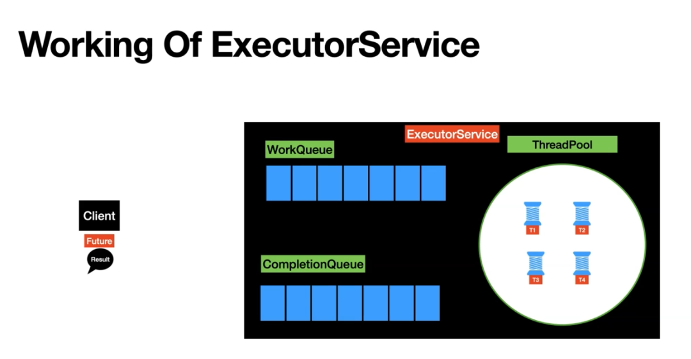

# Thread Pool/ExecuterService & Future

---

## **Introduction**

Multithreading in Java allows for concurrent execution of multiple tasks, improving performance and responsiveness of applications. Understanding how to effectively use multithreading is crucial for developing efficient Java applications.

## **CPU-Intensive Tasks**

- For tasks that require a lot of CPU computation, it's best to have the number of threads equal to the number of CPU cores.
- This allows each thread to be assigned to a core, maximizing CPU utilization and performance.

## **IO-Intensive Tasks**

- Tasks that involve a lot of waiting for IO operations can benefit from having more threads than the number of CPU cores.
- Having more threads allows some to continue working while others are waiting, improving overall efficiency.

## **Summary**

- Use the number of threads equal to the number of CPU cores for CPU-intensive tasks.
- Use more threads than the number of CPU cores for IO-intensive tasks.
- Experiment and tune the number of threads based on your specific application and workload for optimal performance.

---

# Executor Service in Java

## Introduction

Executor Service is a framework provided by Java for managing and executing threads. It simplifies the process of working with threads, especially in scenarios where you need to execute tasks asynchronously or manage a pool of threads efficiently.

## Working of Executor Service

1. **Creating an Executor Service**: You can create an Executor Service using the `Executors` class, which provides factory methods for creating different types of Executor Services.
2. **Submitting Tasks**: Tasks are submitted to the Executor Service using the `submit()` method, which takes a `Runnable` or `Callable` task as an argument.
3. **Execution**: The Executor Service manages the execution of tasks based on the type of Executor Service and the configuration provided.
4. **Shutdown**: After executing all submitted tasks, you should call the `shutdown()` method to gracefully shut down the Executor Service.

## Work Queue

- The work queue is a data structure used by the Executor Service to hold tasks that are waiting to be executed.
- Different types of work queues are available, such as `LinkedBlockingQueue` and `ArrayBlockingQueue`, each with its own characteristics and use cases.

## Future

- The `Future` interface represents the result of an asynchronous computation.
- When you submit a `Callable` task to an Executor Service, it returns a `Future` object, which you can use to retrieve the result of the computation or cancel the task.

## Completion Queue

- The completion queue is a queue used by the Executor Service to hold tasks that have completed their execution.
- Tasks are moved to the completion queue once they have finished executing, and you can retrieve the results from this queue.

## Thread Pool

- A thread pool is a pool of worker threads managed by the Executor Service.
- Instead of creating a new thread for each task, the Executor Service can reuse existing threads from the thread pool, which improves performance and reduces resource consumption.

## Example

```java
import java.util.concurrent.ExecutorService;
import java.util.concurrent.Executors;

public class ExecutorServiceExample {
    public static void main(String[] args) {
        ExecutorService executor = Executors.newFixedThreadPool(2);

        executor.submit(() -> {
            System.out.println("Task 1 running on thread: " + Thread.currentThread().getName());
        });

        executor.submit(() -> {
            System.out.println("Task 2 running on thread: " + Thread.currentThread().getName());
        });

        executor.shutdown();
    }
}

```

In this example, we create an Executor Service with a fixed thread pool of size 2. We then submit two tasks to the Executor Service, which are executed asynchronously by the thread pool.

---

Once upon a time, in a bustling village, there was a wise elder named Executor who was responsible for managing various tasks in the village. The village had many villagers who needed help with different chores, such as farming, building, and crafting.

Executor decided to organize the villagers' tasks more efficiently, so he created a system called Executor Service. This service had a group of worker villagers called the Thread Pool, who were ready to take on tasks at any time.

When a villager needed help with a task, they would submit their request to Executor Service. Executor Service would then assign the task to an available worker villager from the Thread Pool.

The tasks were stored in a queue called the Work Queue, where they waited to be assigned to a worker villager. Each worker villager could only handle one task at a time, so the queue helped organize the tasks and ensure they were completed in order.

As the worker villagers completed their tasks, the results were stored in another queue called the Completion Queue. This queue kept track of the completed tasks and their results, ready for the villagers to collect.

Executor Service also provided a way for the villagers to cancel their tasks if they were no longer needed. This was done using a special object called Future, which represented the result of an asynchronous task. The villagers could use the Future object to check the status of their task and cancel it if necessary.

With Executor Service managing the tasks efficiently, the villagers were able to complete their chores faster and with less effort. The village became more productive, and everyone lived happily ever after.

The end.

---

# **Using ExecutorService vs. Thread.join() in Java**

## **Introduction**

When working with multithreading in Java, it's important to choose the right approach for managing threads and tasks. While both **`ExecutorService`** and **`Thread.join()`** can be used to manage threads, using **`ExecutorService`** offers several advantages over **`Thread.join()`**.

## **Advantages of ExecutorService**

1. **Simplicity**: **`ExecutorService`** provides a higher level of abstraction, making it easier to manage tasks and threads compared to manually using **`Thread.join()`**.
2. **Task Management**: **`ExecutorService`** allows you to submit tasks and manage their execution without directly dealing with threads, simplifying the code and improving readability.
3. **Thread Pooling**: **`ExecutorService`** manages a pool of threads, reusing them for multiple tasks. This reduces the overhead of creating and destroying threads for each task, improving performance.
4. **Flexibility**: **`ExecutorService`** provides different types of thread pools (**`FixedThreadPool`**, **`CachedThreadPool`**, etc.) and configuration options, allowing you to tailor the thread management to your specific requirements.
5. **Exception Handling**: **`ExecutorService`** handles exceptions thrown by tasks, making it easier to handle errors and failures in a centralized manner.
6. **Cancellation and Shutdown**: **`ExecutorService`** provides methods for cancelling tasks (**`cancel()`**), shutting down the executor (**`shutdown()`**), and waiting for the completion of all tasks (**`awaitTermination()`**), simplifying the management of thread lifecycles.

## **Conclusion**

While **`Thread.join()`** can be used to wait for the completion of a single thread, **`ExecutorService`** offers a more flexible, efficient, and manageable way to handle concurrent tasks. It's recommended to use **`ExecutorService`** for managing threads and tasks in Java applications.



