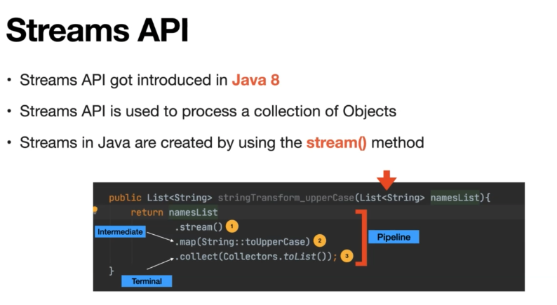

# Parallel Streams

---

## Parallel Streams in Java

## Introduction

Java Streams provide a powerful way to process collections of objects in a functional style. Parallel Streams, introduced in Java 8, allow for parallel processing of streams, leveraging multi-core processors to improve performance for computationally intensive operations.

## How it Works

1. **Stream Creation**: Parallel Streams are created from existing sequential streams using the `parallel()` method.
2. **Underlying Fork-Join Pool**: Parallel Streams use an underlying Fork-Join Pool to divide the stream into smaller tasks and execute them in parallel.
3. **Task Splitting**: The Fork-Join Pool dynamically splits the stream into smaller substreams, which are processed in parallel by different threads.
4. **Combining Results**: As the substreams are processed, their results are combined to produce the final result of the stream operation.

## When to Use Parallel Streams

- **Large Data Sets**: Parallel Streams are most effective for processing large collections of data where the overhead of parallelization is outweighed by the performance gains.
- **Computationally Intensive Operations**: Parallel Streams are well-suited for operations that are computationally intensive and can benefit from parallel execution, such as filtering, mapping, and reducing large data sets.
- **Independence of Elements**: The operations performed on elements in the stream should be independent of each other to ensure correct parallel execution.

## Performance Considerations

- **Overhead**: Parallel Streams introduce overhead for parallelization, so they may not always be more efficient than sequential streams for small data sets or simple operations.
- **Resource Utilization**: Parallel Streams use multiple threads, so they can consume more system resources compared to sequential streams. It's important to monitor resource usage and adjust the parallelism accordingly.
- **Concurrency Issues**: When using Parallel Streams, care must be taken to avoid concurrency issues such as race conditions and data inconsistency. Proper synchronization mechanisms should be used when necessary.

## Example Usage

```java
List<Integer> numbers = Arrays.asList(1, 2, 3, 4, 5, 6, 7, 8, 9, 10);

int sum = numbers.parallelStream()
                 .filter(n -> n % 2 == 0)
                 .mapToInt(n -> n)
                 .sum();

System.out.println("Sum of even numbers: " + sum);

```

In this example, the `parallelStream()` method is used to create a parallel stream from the list of numbers. The stream is then processed in parallel to filter even numbers and calculate their sum.

## Conclusion

Parallel Streams in Java provide a convenient and efficient way to leverage multi-core processors for parallel processing of large data sets. By using Parallel Streams judiciously and understanding their performance characteristics, developers can write more efficient and scalable Java applications.

---


