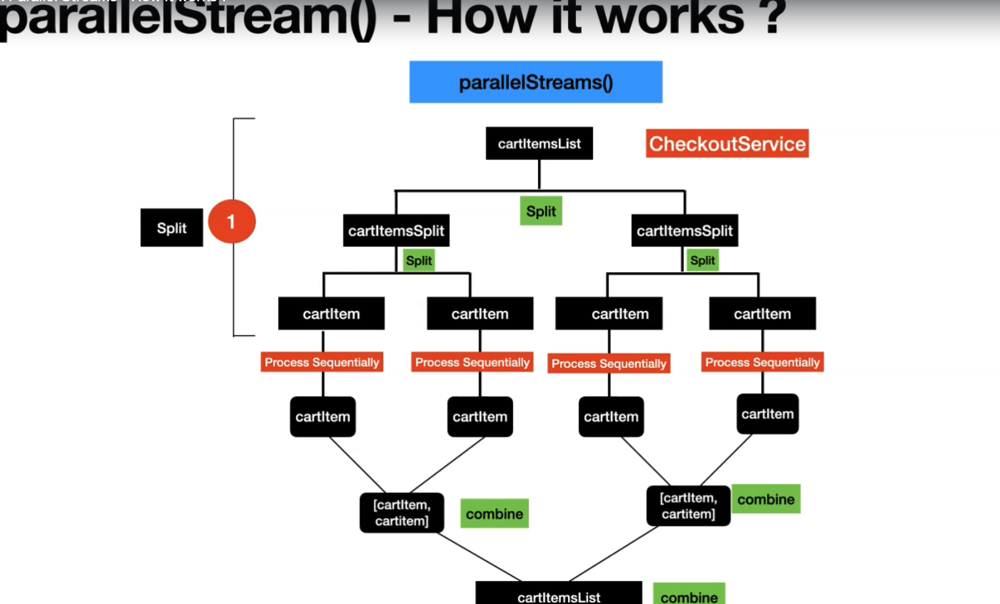

# Parallel Streams - Under the Hood
---



## Introduction

Parallel Streams in the Java Stream API allow for concurrent processing of stream elements, leveraging multi-core processors to improve performance. Understanding how parallel streams work under the hood can help optimize their usage and performance.

## Split, Execute, Combine

- **Split**: When you use a parallel stream, it splits the underlying data source (like a collection) into smaller segments to be processed concurrently. This splitting is done using a spliterator, which is an iterator that can be split into multiple parts.
- **Execute**: Each segment is processed independently in parallel by threads from the common ForkJoinPool. The ForkJoinPool is a special pool of threads designed for handling divide-and-conquer algorithms efficiently.
- **Combine**: Once the processing of segments is complete, the results are combined to produce the final result. This combining process is done using a tree-like structure, where partial results are merged at each level until a single result is obtained.

**Example**:

```java
List<Integer> numbers = Arrays.asList(1, 2, 3, 4, 5, 6, 7, 8, 9, 10);
int sum = numbers.parallelStream().mapToInt(Integer::intValue).sum();

```

## Split Mechanisms

- **Iterator Splitting**: For collections that provide indexed access (like ArrayList), the spliterator splits the iterator into smaller iterators for parallel processing. This allows parallel streams to process different parts of the collection simultaneously.
- **ArrayListSpliterator**: ArrayListSpliterator is a specific implementation of the spliterator interface for ArrayLists. It efficiently splits an ArrayList into smaller chunks for parallel processing, with the smallest chunk being a single element.

**Example**:

```java
List<Integer> numbers = Arrays.asList(1, 2, 3, 4, 5, 6, 7, 8, 9, 10);
Spliterator<Integer> spliterator = numbers.spliterator();

```

## Execution

- **Common ForkJoinPool**: Parallel streams use the common ForkJoinPool for executing parallel tasks. This pool is shared among all parallel streams in the application.
- **Sequential Execution**: Even though tasks are executed in parallel, the order of operations is maintained. This means that if your stream has an order (like in a List), the result will also maintain that order, ensuring correct results.

**Example**:

```java
ForkJoinPool commonPool = ForkJoinPool.commonPool();
int parallelism = commonPool.getParallelism();

```

## Combine and Terminal Operations

- **Combining Results**: Terminal operations, such as collect or reduce, combine the results of parallel segments to produce the final result. This combining process is essential for obtaining the correct result from parallel processing.
- **Data Accumulation**: The collect function uses a mutable data container to accumulate results. Partial results from different segments are merged into this container at each level of the computation, ensuring that all elements are accounted for.

**Example**:

```java
List<Integer> numbers = Arrays.asList(1, 2, 3, 4, 5, 6, 7, 8, 9, 10);
int sum = numbers.parallelStream().reduce(0, Integer::sum);

```

## Performance Considerations

- **ArrayList vs. LinkedList**: The performance difference between parallel and sequential streams is less significant for ArrayLists. This is because ArrayLists can be efficiently split into chunks for parallel processing. On the other hand, LinkedLists are more challenging to split efficiently, which can lead to lower performance gains in parallel streams.
- **Final Computation Result Order**: The type of collection and its spliterator implementation can affect the final result order in parallel streams. For example, ArrayLists maintain their order, while Sets do not guarantee any specific order, which can impact the final result order in parallel streams.

**Example**:

```java
List<Integer> numbers = Arrays.asList(1, 2, 3, 4, 5, 6, 7, 8, 9, 10);
int sum = numbers.parallelStream().reduce(0, Integer::sum);

```

## Conclusion

Parallel Streams in the Stream API provide a powerful mechanism for concurrent processing of stream elements. Understanding the underlying mechanisms and performance considerations can help optimize the usage of parallel streams for improved performance.

---
# Collect vs. Reduce in Stream API

---

## Introduction

Both `collect` and `reduce` are terminal operations in the Stream API used to combine elements of a stream into a single result. However, they differ in their approach and usage.

## `collect` Method

- **Mutability**: The `collect` method is often used when you need to accumulate elements into a mutable result container, such as a `List`, `Set`, or `Map`.
- **Examples**:
    - Collecting elements into a List:

        ```java
        List<Integer> numbers = stream.collect(Collectors.toList());
        
        ```

    - Grouping elements by a property into a Map:

        ```java
        Map<String, List<Employee>> employeesByDepartment = stream.collect(Collectors.groupingBy(Employee::getDepartment));
        
        ```


## `reduce` Method

- **Immutability**: The `reduce` method is used when you want to reduce a stream of elements to a single result, such as finding the sum of all elements or the maximum element.
- **Examples**:
    - Calculating the sum of all elements:

        ```java
        int sum = stream.reduce(0, Integer::sum);
        
        ```

    - Finding the maximum element:

        ```java
        Optional<Integer> max = stream.reduce(Integer::max);
        
        ```


## When to Use Collect and Reduce

- **Collect**: Use `collect` when you need to accumulate elements into a mutable result container or perform complex transformations that are not easily achievable with `reduce`.
- **Reduce**: Use `reduce` when you want to reduce a stream of elements to a single result, such as finding the sum, maximum, or any other aggregation operation.

## Mutable and Immutable

- **Mutable**: Objects that can be modified after they are created are considered mutable. For example, `ArrayList` is mutable because you can add or remove elements from it after creation.
- **Immutable**: Objects that cannot be modified after they are created are considered immutable. For example, `String` in Java is immutable because once created, its value cannot be changed.

## Example Methods

### Using `sum` with `mapToDouble` and `sum`

```java
private double calculateFinalPrice(Cart cart) {
    return cart.getCartItemList().parallelStream()
            .map(item -> item.getQuantity() * item.getRate())
            .mapToDouble(Double::doubleValue)
            .sum();
}

```

### Using `collect` with `summingDouble`

```java
private double calculateFinalPriceCollect(Cart cart) {
    return cart.getCartItemList().parallelStream()
            .map(item -> item.getQuantity() * item.getRate())
            .collect(Collectors.summingDouble(Double::doubleValue));
}

```

### Using `reduce` with accumulator function

```java
private double calculateFinalPriceReduce(Cart cart) {
    return cart.getCartItemList().parallelStream()
            .map(item -> item.getQuantity() * item.getRate())
            .reduce(0.0, (x, y) -> x + y);
}

```

In these examples, `calculateFinalPrice` calculates the final price using `sum` with `mapToDouble` and `sum`, `calculateFinalPriceCollect` uses `collect` with `summingDouble`, and `calculateFinalPriceReduce` uses `reduce` with an accumulator function. Each method achieves the same result but demonstrates different ways to use the Stream API for aggregation operations.

## Conclusion

Understanding the differences between `collect` and `reduce`, as well as when to use each, is key to writing efficient and effective stream processing code in Java.