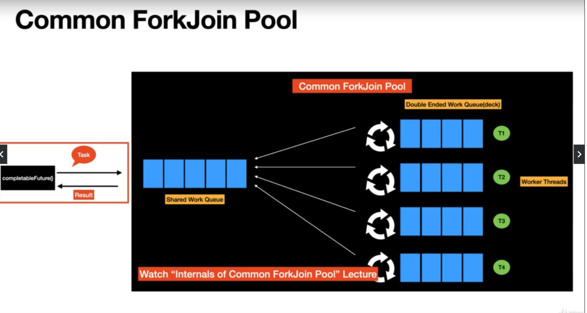

### Introduction

CompletableFuture in Java relies on thread pools for executing asynchronous tasks. These thread pools manage the threads that execute the tasks and ensure efficient use of system resources.

### Internals of Common ForkJoinPool

The Common ForkJoinPool is a shared pool of threads used by CompletableFuture and parallel streams. It internally uses the work-stealing algorithm to improve task distribution and utilization of threads.

### Thread Pools Used in CompletableFuture

When you create a CompletableFuture using `supplyAsync()` or `runAsync()`, it uses the common ForkJoinPool by default. However, you can also specify a different executor or thread pool to be used for executing the CompletableFuture's tasks.

### Example of Using Executors.newFixedThreadPool

```java
ExecutorService executor = Executors.newFixedThreadPool(5);
CompletableFuture<Integer> future = CompletableFuture.supplyAsync(() -> {
    // Perform computation asynchronously
    return 42;
}, executor);

```

In this example, the `supplyAsync()` method uses a fixed-size thread pool with 5 threads for executing the computation.

### Advantages of Using a Different ThreadPool

Using a different thread pool allows you to customize the thread pool configuration, such as the number of threads, thread factory, and rejection policy. This can be useful for tuning the performance of your application and managing resources more efficiently.

### Scenario: Seat Booking for Seat Allocation

To handle seat booking with no two people getting the same seat, you can use a ConcurrentMap to track seat availability. Each seat can be represented by a key in the map, and the value can indicate whether the seat is available or not. Here's how you can handle it using CompletableFuture and Java 8 features:

```java
ConcurrentMap<Integer, Boolean> seatMap = new ConcurrentHashMap<>();
// Initialize seatMap with all seats as available

CompletableFuture<Void>[] futures = new CompletableFuture[10]; // 10 people trying to book

for (int i = 0; i < 10; i++) {
    int seatNumber = i; // Assuming seat number is same as index
    futures[i] = CompletableFuture.runAsync(() -> {
        // Check if seat is available
        boolean seatAvailable = seatMap.putIfAbsent(seatNumber, false) == null;
        if (seatAvailable) {
            System.out.println("Seat " + seatNumber + " booked by " + Thread.currentThread().getName());
        } else {
            System.out.println("Seat " + seatNumber + " already booked, trying another seat.");
        }
    });
}

CompletableFuture<Void> allBookings = CompletableFuture.allOf(futures);
allBookings.join(); // Wait for all bookings to complete

```

In this scenario, each CompletableFuture represents a person trying to book a seat. The `putIfAbsent()` method of ConcurrentMap ensures that only one person can book a seat at a time, preventing two people from getting the same seat.

---

The code you provided is mostly correct for a basic seat booking scenario using `CompletableFuture` and a `ConcurrentMap` to track seat availability. However, there are a few improvements and considerations:

1. **Initialization of seatMap**: It's important to initialize `seatMap` with all seats as available before starting the booking process.
2. **Seat Number**: Assuming seat numbers are sequential starting from 0, it's correct to use `i` as the seat number.
3. **Handling Seat Booking**: The `putIfAbsent` method in `ConcurrentMap` is used correctly to check and mark a seat as booked atomically. However, you might want to consider using `compute` or `merge` methods for more complex booking scenarios where the seat status might need to be updated based on current availability.
4. **Printing Output**: The output format for booking messages is clear and informative.
5. **Completion of All Bookings**: Using `CompletableFuture.allOf` to wait for all booking tasks to complete is a good approach.

Overall, the code is a good starting point for a simple seat booking system. Depending on the complexity of your application, you might need to add additional features such as handling seat release, timeout for booking attempts, or handling seat availability updates from external sources.

Here's a slightly modified version of your code with the initialization of `seatMap` and a small improvement in booking logic:

```java
ConcurrentMap<Integer, Boolean> seatMap = new ConcurrentHashMap<>();
// Initialize seatMap with all seats as available
for (int i = 0; i < 10; i++) {
    seatMap.put(i, true); // Assuming all seats are initially available
}

CompletableFuture<Void>[] futures = new CompletableFuture[10]; // 10 people trying to book

for (int i = 0; i < 10; i++) {
    int seatNumber = i; // Assuming seat number is same as index
    futures[i] = CompletableFuture.runAsync(() -> {
        // Check if seat is available
        boolean seatAvailable = seatMap.replace(seatNumber, true, false);
        if (seatAvailable) {
            System.out.println("Seat " + seatNumber + " booked by " + Thread.currentThread().getName());
        } else {
            System.out.println("Seat " + seatNumber + " already booked, trying another seat.");
        }
    });
}

CompletableFuture<Void> allBookings = CompletableFuture.allOf(futures);
allBookings.join(); // Wait for all bookings to complete

```

This code assumes that all seats are initially available and marks them as unavailable when booked. Adjustments may be needed based on your specific requirements.


